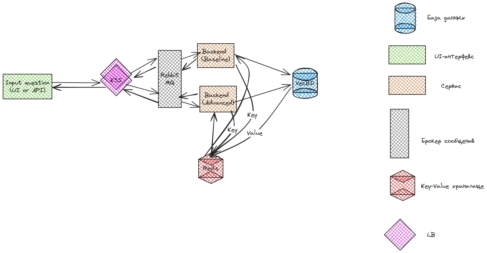

# Chatbot_support_for_X5

# О чем это проект?
Этот проект призван решить проблему поиска ответа на пользовательский вопрос. За время работы X5 накопилась огромная база знания с парами "вопрос-ответ", из-за чего руководство компании решило выставить на первую линию общения чат-бота вместо оператора. Если пользовать удовлетворен ответом на свой вопрос от чат-бота - он не идет дальше на вторую линию к операторам, что, в свою очередь, снижает нагрузку, затраты и смещает акцент реагирования только на те вопросы, которых нет в базе знаний.

# Уникальность решения
Мы понимаем, что кейс, прежде всего, про продукт, и у каждого продукта есть свои непреложные законы развития. Один из основополагающих - необходимость быстрого и дешевого запуска с последующим итеративным дополнением. Принимая данный факт как руководящий ориентир, наша команда не стала начинать с использования сложных инструментов, требущих больших вычислительных мощностей, например, RAG с LLM, а пошла по пути создания максимально упрощенной модели, способной максимально дешевым образом закрыть в кратчайшие сроки имеющуюся проблему. Тут следует отметить, что, несмотря на последующее неизбежное техническое усложнение проекта, наш MVP также сможет использоваться как запасной вариант на случай падения API к LLM.

# Что под капотом?
Данная версия baseline-решения работает на основе TF-IDF и Word2vec алгоритмов поиска, а также модели на базе данных с парами "вопрос-ответ". Подобный подход не требует серьёзных вычислительных мощностей, финансовых затрат и представляет собой быстрое решение в условиях ограниченного времени и ресурсов.

# Pipeline


# Как пользоваться чат-ботом?
Существует 2 способа общения с чат-ботом:
1. Пользовательский интерфейс чат-бота, написанный на Streamlit. Интерфейс доступен по адресу https://x6-bot.streamlit.app/.
2. API к чат-боту, написанное на FastAPI. Для использования API необходимо сделать запрос.
**Пример запроса для Curl:**
```
curl -G "http://95.182.121.46:8080/query" --data-urlencode "query=Я сменил автомобить, на учет еще не поставил, могу ли я заправляться по топливной карте?"
```
**Пример запроса для Postman:**
1. Открыть *Postman*
2. Добавить новый *GET-запрос*
3. В URL ввести:
```
http://95.182.121.46:8080/query?query=Я сменил автомобить, на учет еще не поставил, могу ли я заправляться по топливной карте?
```


# Документация
Нами был составлен ML System Design Doc для baseline-решения, в котором описана вся методология проекта. Ознакомиться с ML System Design Doc можно в директории docs.


# Организация проекта
```
.
├── backend  <-- Backend проекта
│   ├── data  <-- Данные для работы с базой данных
│   │   └── LK_modified.xlsx  <-- База данных с парами "вопрос-ответ"
│   ├── requirements.txt  <-- Требуемые пакеты для работы с бэкендом
│   └── src  <-- Исходные коды для работы с бэкендом
│       ├── baseline  <-- Базовый алгоритм поиска ответа на вопрос
│       │   ├── baseline.py  -  Базовый алгоритм поиска ответа на вопрос
│       │   ├── Dockerfile  <-- Dockerfile для базового алгоритма поиска ответа на вопрос
│       │   ├── model.py  <-- Модель на базе данных с парами "вопрос-ответ"
│       │   └── requirements.txt  <-- Требуемые пакеты для работы с базовым алгоритмом поиска ответа на вопрос
│       └── proxy  <-- Прокси для работы с бэкендом
│           ├── Dockerfile  <-- Dockerfile для прокси для работы с бэкендом
│           └── proxy.py  <-- Прокси для работы с бэкендом
├── docker-compose.yml  <-- Докер-компоуз для работы с бэкендом
├── docs  <-- Документация по работе с бэкендом
│   └── ML System Design Doc - Chat-bot for X5.md  <-- Документация по работе с бэкендом
├── notebooks  <-- PоC
│   └── PoC_Chat_bot_for_X5.ipynb
├── README.md
└── ui  <-- UI проекта
    ├── requirements.txt  <-- Требуемые пакеты для работы с пользовательским интерфейсом
    └── streamlit_app.py  <-- Пользовательский интерфейс
```

# Инструменты проекта
        
